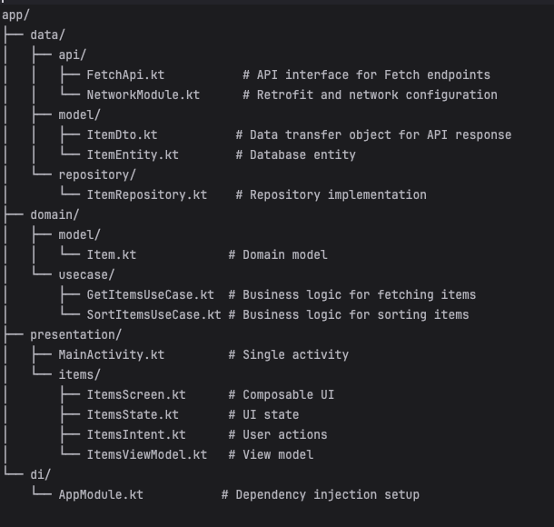

# 📱 Fetch Rewards Coding Exercise

  
  
  

## 📝 Description

This Android application fetches data from a remote JSON endpoint, processes it according to specific requirements, and displays it in an organized, user-friendly list. The app demonstrates modern Android development practices, clean architecture, and efficient data handling.

## ✨ Features

- 📊 Displays items grouped by listId
- 🔄 Sorts items by listId and name
- 🔍 Filters out items with blank/null names
- 📱 Modern Material Design 3 UI
- 🌐 Handles network states
- ⚡ Efficient data processing
- 💾 Error handling

## 🛠 Technology Stack

### Architecture
- **MVI (Model-View-Intent)** - Unidirectional data flow pattern
- **Repository Pattern** - Single source of truth for data
- **Clean Architecture** - Separation of concerns with use cases

### Libraries & Dependencies

#### 🏗 Core
- **Kotlin** - 100% Kotlin codebase
- **Coroutines + Flow** - Asynchronous & reactive programming
- **StateFlow** - State management
- **AndroidX Lifecycle** - Lifecycle-aware components
- **Compose Runtime** - State management utilities

#### 🌐 Networking
- **Retrofit2** - Type-safe REST client
- **KotlinX Serialization** - Modern JSON parsing
- **OkHttp3** - HTTP client with interceptors

#### 💉 Dependency Injection
- **Hilt** - Dependency injection framework
- **KSP** - Kotlin Symbol Processing

#### 📱 UI Components
- **Jetpack Compose** - Modern declarative UI
- **Material Design 3** - Latest Material You design

#### 🧪 Testing
- **Turbine** - Flow testing
- **MockK** - Kotlin-first mocking
- **Kotest** - Kotlin testing framework
- **Robolectric** - Unit tests for Android

## 🏗 Project Structure

  

